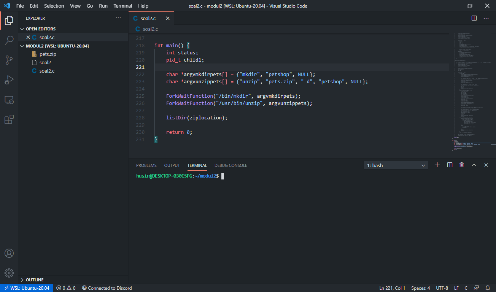

# Soal-shift-sisop-modul-2-A06-2021
Jawaban soal praktikum Sistem Operasi modul 2.

**Anggota kelompok**:
```
- Richard Asmarakandi       05111940000017
- Muhammad Rafki Mardi      05111940000054
- Husin Muhammad Assegaff   05111940000127
```
---
## Tabel Konten
- [Soal 1](#soal-1)
  - [Soal 1.a](#soal-1a)
  - [Soal 1.b](#soal-1b)
  - [Soal 1.c](#soal-1c)
  - [Soal 1.d](#soal-1d)
  - [Soal 1.e](#soal-1e)
  - [Soal 1.f](#soal-1f)

- [Soal 2](#soal-2)
  - [Soal 2.a](#soal-2a)
  - [Soal 2.b](#soal-2b)
  - [Soal 2.c](#soal-2c)
  - [Soal 2.d](#soal-2d)
  - [Soal 2.e](#soal-2e)

- [Soal 3](#soal-3)
  - [Soal 3.a](#soal-3a)
  - [Soal 3.b](#soal-3b)
  - [Soal 3.c](#soal-3c)
  - [Soal 3.d](#soal-3d)
  - [Soal 3.e](#soal-3e)

## Soal 1
**[Source Code Soal 1](https://github.com/husinassegaff/soal-shift-sisop-modul-2-A06-2021/blob/main/soal1/soal1.c)**

**Deskripsi:**\
Steven ingin membuat Stevany terkagum dengan menjadi ahli dalam matkul SISOP. Hal yang dilakukan Steven adalah membuat sebuah `program` yang akan menghasilkan File zip berisikan foto, video, dan musik kegemaran Stevany dihari ulang tahunnya.

Untuk mewujudkan hal tersebut Steven ingin agar program tersebut berkerja secara bertahap dalam dua fase.

- Fase pertama, enam jam sebelum ulang tahun Stevany, program `daemon` melakukan secara berurut - urut :
    
    - Membuat direktory dengan nama `Musyik`, `Fylm` dan `Pyoto`.
    - Mengunduh file `.zip` dari link yang disertakan.
    - Mengekstrak `.zip` yang sudah diunduh.
    - Memindahkan file yang ada ada di folder hasil ekstrak ke direktory yang sudah di buat.

- Fase kedua, saat tahun Stevany, program `daemon` melakukan secara berurut - urut :

    - Menzip ketiga direktory yg dibuat ke nama `Lope_you_Stevany.zip`
    - Menghapus direktory yang ada, sehingga menyisakan zip.

**Catatan:**
- Ulang Tahun Stevany : 09 April Pukul 22.22 WIB
- Program berjalan secara `daemon`.
- Tidak boleh menggunakan fungsi `system()`, `mkdir()`, dan `rename()`.
- Tidak boleh pake `cron`.

**_Prequisite_:**

- Karena program harus berjalan secara `daemon`, digunakan template dari [modul 2](https://github.com/arsitektur-jaringan-komputer/Modul-Sisop/blob/master/2021/Modul2/README.md#3-implementasi-daemon).
- Tahapan :
    - Fork _parent process_ dan kill parent proces
    - Mengubah _permission_ interaksi programm daemon dengan program yang ada di _working directory_.
    - Agar dapat berjalan, _child process_ membuat session ID sendiri agar dapat berjalan tanpa _parent_.
    - Mengubah tempat program `daemon` bekerja.
    - Menutup deskripsi standar file alias interaksi ke terminal.
    - Membuat loop utama sebagai tempat program yang ingin kita `daemon`-kan.
- _Library_ yang digunakan berupa

```c
#include <stdio.h>      // library standar
#include <sys/types.h>  // penghasil proses
#include <sys/stat.h>   // Akses atribut informasi
#include <stdlib.h>     // kontrol proses
#include <fcntl.h>      // kontrol file
#include <errno.h>      // kontrol error
#include <unistd.h>     // interaksi dengan POSIX
#include <syslog.h>     // kontrol log dan event
#include <string.h>     // untuk manipulasi string
#include <time.h>       // untuk interaksi terhadap waktu sistem
#include <sys/wait.h>   // agar program tidak terhenti pasca exec ()
#include <dirent.h>     // untuk interaksi terhadap direktory dan isinya
```
- Penyelesaian permintaan soal dilakukan di loop utama.
```c
...   
  while (1) {
    // Tulis program kalian di sini

    sleep(1);
  }
}
...
```
note: 

tanda `...` merupakan kode program yang tidak ditampilkan untuk memudahkan pembacaan.
- Program `daemon` memiliki `sleep(1)` yang berarti akan berjalan setiap satu detik.
- Karena program memiliki trigger berupa waktu, digunakan fungsi dan tipe data dari _library_ `time.h` yakni,
```c
...
time_t rawtime;
struct tm * timeinfo;
int i, stat;
time ( &rawtime );
timeinfo = localtime ( &rawtime );
...
```
note: 

tanda `...` merupakan kode program yang tidak ditampilkan untuk memudahkan pembacaan.

- Variabel `time_t` nantinya akan menyimpan nilai waktu.
- Fungsi `time()` mengembalikan lama waktu sejak 1 Januari 1970 dalam detik.
- Untuk `localtime()` mengembalikan waktu dalam bentuk pointer yang telah terbagi informasi waktnya (detik, menit, hari, tanggal dan seterusnya).
- Dengan `sleep(1)` setiap detih, program akan mengambil nilai waktu tiap satu detik dan dicek ke sebuak _conditional statement_.
- Untuk membagi perintah ke dua periode (enam jam sebelum waktu ulang tahun dan saat ulang tahun) digunakan `if` dan `else if` _conditional statement_
```c
...
// Enam jam sebelum ulang tahun, 9 April 2021 16:22:00
if(timeinfo->tm_mon == 3 && timeinfo->tm_mday== 9 && timeinfo->tm_hour== 16 && timeinfo->tm_min==22 && timeinfo->tm_sec==0){
    ...
}// Waktu ulang tahun, 9 April 2021 16:22:00
else if (timeinfo->tm_mon == 3 && timeinfo->tm_mday== 9 && timeinfo->tm_hour== 22 && timeinfo->tm_min==22 && timeinfo->tm_sec==0){
    ...
}
...
```

note: 

tanda `...` merupakan kode program yang tidak ditampilkan untuk memudahkan pembacaan.

- Karena setiap proses, jika tidak ditangani, akan mengakhiri program digunakan template ini supaya proses tidak langsung menutup program.
```c
...
if ((pid = fork()) == 0){
    //proses
}else{
    waidpid(pid,&stat,0);
    if(WIFEXITED(pid))
    //proses selanjutnya
}
...
```
- Pada kode diatas, kondisi `if` melakukan `fork()` terhadap `daemon`.
- Setelah proses selesai akan dibuat sebuah inisiasi tunggu proses yang baru saja di `fork` dengan nilai tunggu `stat`.
- Pada `WIFEXITED(pid)` memberitahu jika proses `fork(pid)` sudah selesai lakukan perintah selanjutnya.
- Untuk periode pertama, strategi yang dilakukan dalam penyelesaian soal ini adalah dengan iterasi 3 kali yang mana tiap iterasi , secara bertahap, melakukan permintaan `a` hingga `d`.
- Untuk mewujudkan hal ini, kita kembali ke kode di atas, kita melakukan _nested_ 
```c
...
for (i=0; i<3; i++)
{
    if ((pid = fork()) == 0){
        if ((pid = fork()) == 0){
            if ((pid = fork()) == 0){
                //proses a
            }else{
                waidpid(pid,&stat,0);
                if(WIFEXITED(pid))
                //proses b
            }
        }else{
            waidpid(pid,&stat,0);
            if(WIFEXITED(pid))
            //proses c
            else{
                waidpid(pid,&stat,0);
                if(WIFEXITED(pid))
                //proses d
            }
        }
    }
}
...
```

*Soal 1.a hingga 1.d berjalan saat kondisi waktu adalah 9 April dan waktu pukul 16:22:00.*

### Soal 1.a

**Deskripsi:**\
Pada periode pertama, yakni enam jam sebelum ulang tahun Stevany program membuat sebuah direktory bernama `Musyik`, `Fylm` dan `Pyoto`.

**Pembahasan:**

```c
...
char n[3][20]={
    "Musyik",
    "Pyoto",
    "Fylm"
};
...
for (i=0; i<3; i++)
{
    if (...){
        if (...){
            if((pid=fork())==0){
                // proses a
                char *argv[] = {"mkdir",n[i], NULL};
                execv("/bin/mkdir", argv);
            }else
            ...
        }else
        ...
    }else
    ...
}
```

- Proses dilakukan di `proses a`.
- Dibantu array string `n[i][]` untuk menyimpan nama direktory yang akan dibuat.
- Menggunakan `execv(tipe,argumen)` dan pointer string `argv[]`.
- Melaksanakan perintah pembuatan direktori `mkdir` dengan tipe `/bin/mkdir`.
- Tiap iterasi akan membuat direktory sesuai urutan array string.

**Kendala :**\
Tidak ada.

### Soal 1.b
**Deskripsi:**\
Mengunduh file dengan `wget` dari link yang disertakan pada modul soal.

**Pembahasan:**

```c
...
char link[3][100]={
    "https://drive.google.com/uc?id=1ZG8nRBRPquhYXq_sISdsVcXx5VdEgi-J&export=download",
    "https://drive.google.com/uc?id=1FsrAzb9B5ixooGUs0dGiBr-rC7TS9wTD&export=download",
    "https://drive.google.com/uc?id=1ktjGgDkL0nNpY-vT7rT7O6ZI47Ke9xcp&export=download"
};
char rn[3][20]={
    "Musyik.zip",
    "Pyoto.zip",
    "Fylm.zip"
};
...
for (i=0; i<3; i++)
{
    if (...){
        if (...){
            if((pid=fork())==0){
                ...
            }else{
                waitpid(pid,&stat,0);
                if (WIFEXITED(stat))
                {
                    char *argv[] = {"wget", "--no-check-certificate",link[i],"-O",rn[i], NULL};
                    execv("/usr/bin/wget", argv);
                }
            }
        }
        ...
    }
    ...
}
```

- Proses dilakukan di `proses b`.
- Dibantu array string `link[i][]` untuk link _download_ dan `rn[i][]` untuk penamaan hasil `wget`.
- Menggunakan `execv(tipe,argumen)` dan pointer string `argv[]`.
- Melaksanakan perintah pengunduhan `wget` dengan tipe `/usr/bin/wget`.
- Opsi `--no-check-certification`
- Opsi `-o` untuk memberikan nama `rn[i][]` dari hasil `wget` nantinya.
- Tiap iterasi akan mengunduh file secara berurut sesuai dengan array (MUSIK, FOTO, FILM).

**Kendala :**\
Tidak ada.

### Soal 1.c
**Deskripsi:**\
Ekstrak file `.zip` yang sudah diunduh melalui `wget`.

**Pembahasan:**

```c
...
char link[3][100]={
    "https://drive.google.com/uc?id=1ZG8nRBRPquhYXq_sISdsVcXx5VdEgi-J&export=download",
    "https://drive.google.com/uc?id=1FsrAzb9B5ixooGUs0dGiBr-rC7TS9wTD&export=download",
    "https://drive.google.com/uc?id=1ktjGgDkL0nNpY-vT7rT7O6ZI47Ke9xcp&export=download"
};
...
char n1[3][20]={
    "MUSIK",
    "FOTO",
    "FILM"
};
...
for (i=0; i<3; i++)
{
    if (...){
        if (...){
            if((pid=fork())==0){
                ...
            }else{
                ...
            }
        }else{
            waitpid(pid,&stat,0);
            if (WIFEXITED(stat))
            {
                if((pid=fork())==0)
                {
                    char *argv[] = {"unzip",rn[i], NULL};
                    execv("/usr/bin/unzip", argv);
                }else
                ...
            }
        }
    }else
    ...
}

```

- Proses dilakukan di `proses c`.
- Dibantu array string `n1[i][]`.
- Menggunakan `execv(tipe,argumen)` dan pointer string `argv[]`.
- Melaksanakan `unzip`, dengan tipe `/usr/bin/unzip`.

**Kendala :**\
Tidak ada.

### Soal 1.d
**Deskripsi:**\
Memindahkan file dari direktori hasil ekstrak file `.zip` ke direktory yang dibuat dengan `mkdir`.

**Pembahasan:**

```c
...
char n1[3][20]={
    "MUSIK",
    "FOTO",
    "FILM"
};
char n[3][20]={
    "Musyik",
    "Pyoto",
    "Fylm"
};
...
DIR *dp;
struct dirent *ep;
...
for (i=0; i<3; i++)
{
    if (...){
        if (...){
            if((pid=fork())==0){
                ...
            }else{
                ...
            }
        }else{
            waitpid(pid,&stat,0);
            if (WIFEXITED(stat))
            {
                if((pid=fork())==0){
                    ...
                }else{
                    waitpid(pid,&stat,0);
                    if (WIFEXITED(stat))
                    {
                        getcwd(path, sizeof(path));
                        strcat(path,"/");
                        strcpy(target,"");
                        strcpy(target,path);
                        strcat(target,n[i]);
                        strcat(path,n1[i]);
                        dp = opendir(path);
                        while ((ep = readdir (dp))) {
                            strcpy(file,"");
                            strcpy(file,path);
                            if (strcmp(ep->d_name, ".") != 0 && strcmp(ep->d_name, "..") != 0){
                                if ((pid = fork()) == 0)
                                {
                                        strcat(file,"/");
                                        strcat(file,ep->d_name);
                                        char *argv[] = {"mv",file, target, NULL};
                                        execv("/bin/mv", argv);      
                                }else{
                                    waitpid(pid, &stat,0);
                                }
                            }
                        }
                    }
                }
            }
        }
    }else
    ...
}

```

- Proses dilakukan di `proses d`.
- Menggunakan tipe data dari `DIR` dengan pointer `*dp` untuk menunjuk direktori tersebut.
- `struct dirent` `*ep` sebagai penunjuk entitas dalam direktori.
- Fungsi `getcwd()` sebagai fungsi untuk mengambil `path` tempat program `daemon` berjalan.
- `path` kemudian disalin ke `target` karna perpindahan masih terhadap jalur relatif sama.
- String `path` kemudian ditambahkan nama direktori `n1[i][]`yang filenya akan dipindahkan melalui `strcat()`.
- String `target` kemudian ditambahkan nama `n[i][]` direktori tujuan penyimpanan `strcat()`.
- Dengan bantuan _library_ `dirent.h` kita menggunakan fungsi `opendir()` untuk mengakses konten direktori.
- Kemudian dengan fungsi `while(ep = readdir(dp))` diiterasi setiap file yang ada di dalam direktory dengan bantuan struct `ep`.
- `ep ->d_name` mewakili nama dari sebuah file, karna hanya file yang dipindahkan digunakan `if` _condition_ dan string yang ditunjuk `ep->d_name` akan disalin ke string `file` sebagai target file yang akan dipindahkan.
- Menggunakan `execv(tipe,argumen)` dan pointer string `argv[]`.
- Printah move berupa `mv` yang mempunyai tipe `/bin/mv`.
- Kegiatan akan berulang sebanyak tiga kali.

**Kendala :**\
Tidak ada.

```
Ringkasan proses periode pertama

Jika waktu == 9 April, 16:22:00, maka,
    mkdir → wget → unzip → move
selesai.
```
**Bukti Periode Pertama:**

https://user-images.githubusercontent.com/74223938/115844419-fda5c700-a449-11eb-8890-e513f2e1900f.mp4

*Soal 1.a hingga 1.d berjalan saat kondisi waktu adalah 9 April dan waktu pukul 22:22:00.*

### Soal 1.e
**Deskripsi:**\
Menzip tiga direktory yang sebelumnya sudah diisikan file file sesuai kategori namanya.

**Pembahasan:**
```c
char n[3][20]={
    "Musyik",
    "Pyoto",
    "Fylm"
};
...
else if (timeinfo->tm_mon == 3 && timeinfo->tm_mday== 9 && timeinfo->tm_hour== 22 && timeinfo->tm_min==22 && timeinfo->tm_sec==0){

        // komponen zip
        
        if ((pid = fork()) == 0)
        {    
            char *argv[] = {"zip","-r","Lopyu_Stevany.zip",n[0],n[1],n[2], NULL};
            execv("/usr/bin/zip", argv);
        }else{
            waitpid(pid,&stat,0);
            ...
        }
    }
    ...
```

- Menggunakan `execv(tipe,argumen)` dan pointer string `argv[]`.
- Printah move berupa `zip` yang mempunyai tipe `/usr/bin/zip`.
- Opsi `-r` dilakukan untuk melakukan `zip` terhadap lebih dari satu direktori `n[0]`,`n[1]`, dan `n[2]`.

**Kendala :**\
Tidak ada.

### Soal 1.f
**Deskripsi:**\
Menghapus direktory yang tersisa, menyisakan file `.zip`

**Pembahasan:**
```c
char n[3][20]={
    "Musyik",
    "Pyoto",
    "Fylm"
};
char n1[3][20]={
    "MUSIK",
    "FOTO",
    "FILM"
};
...
else if (timeinfo->tm_mon == 3 && timeinfo->tm_mday== 9 && timeinfo->tm_hour== 22 && timeinfo->tm_min==22 && timeinfo->tm_sec==0){

        // komponen zip
        
        if ((pid = fork()) == 0)
        {    
            ...
        }else{
            waitpid(pid,&stat,0);
            char *argv[] = {"rm","-r",n[0],n[1],n[2],n1[0],n1[1],n1[2], NULL};
            execv("/bin/rm", argv);
        }
    }
    ...
```

- Menggunakan `execv(tipe,argumen)` dan pointer string `argv[]`.
- Printah move berupa `rm` yang mempunyai tipe `/bin/rm`.
- Opsi `-r` dilakukan untuk menghapus direktori mulai dari kontennya, barulah direktori itu sendiri.

**Bukti Periode Dua    :**

https://user-images.githubusercontent.com/74223938/115844446-06969880-a44a-11eb-9601-b54a217497dc.mp4

**Kendala :**\
Tidak ada.

---
## Soal 2 
**[Source Code Soal 2](https://github.com/husinassegaff/soal-shift-sisop-modul-2-A06-2021/blob/main/soal2/soal2.c)**

**Deskripsi:**\
Pada soal ini diminta untuk mengkategorikan foto-foto hewan pada file zip menggunakan program. Selain mengkategorikan, juga harus mengubah nama file dan menyimpan data hewan ke file berbentuk .txt

**Catatan:**\
- Setiap data peliharaan disimpan sebagai nama foto dengna format **[jenis peliharaan]:[nama peliharaan:[umumr peliharaan dalam tahun]**. Apabila terdapat lebih dari satu peliharaan, maka data dipisahkan menggunakan *underscore*
- Tidak diperbolehkan menggunakan fungsi **system()**, **mkdir()**, dan **rename()**
- Menggunakan **fork** dan **exec**


Adapun untuk library yang kami gunakan adalah sebagai berikut,

```c
#include <stdio.h>      // library standar
#include <sys/types.h>  // penghasil proses
#include <stdlib.h>     // kontrol proses
#include <unistd.h>     // interaksi dengan POSIX
#include <string.h>     // untuk manipulasi string
#include <wait.h>       // agar program tidak terhenti pasca exec ()
#include <dirent.h>     // untuk interaksi terhadap direktory dan isinya
```

Juga membuat fungsi yang mengeksekusi `exec` agar programnya tidak terlalu panjang. Fungsinya diberi nama `ForkWaitFunction()` sebagai berikut,

```c
void ForkWaitFunction(char bash[], char *arg[]){
    int status;
    pid_t child;
    child = fork();
    if(child == 0){
        execv(bash, arg);
    }
    else{
        ((wait(&status))>0);
    }
}
```


### Soal 2.a
**Deskripsi:**\
Diminta untuk mengekstraksi zip yang telah diberikan ke dalam folder `/home/[user]/modul2/petshop`. Serta menghapus folder-folder yang berada di dalam zip tersebut yang tidak digunakan

**Pembahasan:**
```c
...
char ziplocation[] = "/home/husin/modul2/petshop";
const char semicolon[] = ";";
const char udr[] = "_";

int main() {
    int status;
    pid_t child1;

    char *argvmkdirpets[] = {"mkdir", "petshop", NULL};
    char *argvunzippets[] = {"unzip", "pets.zip", "-d", "petshop", NULL};
    
    ForkWaitFunction("/bin/mkdir", argvmkdirpets);
    ForkWaitFunction("/usr/bin/unzip", argvunzippets);
    
    listDir(ziplocation);

    return 0;
}

void listDir(char *basePath)
{

    struct dirent *dp;

    FILE * fp;

    char typepetsfoldername[200] = "";
    char filepetsname[100] = "";
    char typepetslocation[100] = "/home/osd0081/Desktop/Sisop/soal-shift-sisop-modul-2-A06-2021/soal2/petshop";
    char *token;
    char *limit;
    char *age;
    char name[20];
    char echoke[100];
    char file[20];
    char file1[20];
    char binatang[20];
    char test[20];
    char hewan[100];
    char text[100];

    int notif = 0;
    int cek = 0;
    int more = 0;
    
    DIR *dir = opendir(basePath);

    while ((dp = readdir(dir)))
    {
        if (strcmp(dp->d_name, ".") != 0 && strcmp(dp->d_name, "..") != 0 && dp->d_type == DT_DIR)
        {
            char petslocation[100] = "/home/osd0081/Desktop/Sisop/soal-shift-sisop-modul-2-A06-2021/soal2/petshop";
            strcat(petslocation,"/");
            strcat(petslocation, dp->d_name);
            char *argvrmfolder[] = {"rm", "-rf", petslocation, NULL};
            ForkWaitFunction("/bin/rm", argvrmfolder);
        }
    }
...
```

- Menggunakan char `*argvmkdirpets[]` untuk membuat perintah buat folder petshop, begitu juga untuk `*argvunzippets[]` berisi perintah unzip folder zip pets yang telah diunduh sebelumnya. Kemudian dijalankan dua perintah tersebut dengan fungsi `ForkWaitFunction()`
- Setelah itu, menuju ke fungsi `listDir()` dengan menunjuk lokasi folder petshop yang disimpan di variabel **ziplocation**. 
- Fungsi ini menggunakan template yang ada di modul pada bagian **Directory Listing** yang rekursif. Hanya saja telah dimodifikasi mengikuti keperluan soal
- Jadi pada `while ((dp = readdir(dir)))` memeriksa apakah lokasi folder yang ditunjuk ada atau tidak, maka jika ada akan menuju percabangan yang memeriksa apakah lokasi yang ditunjuk saat ini berbentuk folder atau tidak.
- Apabile berbentuk folder, maka percabangan if akan dieksekusi berupa pembuatan directory folder tersebut dengan memanipulasi char menggunakan `strcat` atau menggabungkan char pertama dengan char kedua
- Jadi, awalnya inisiasi char `petslocation` yang berupa **/home/husin/modul2/petshop**
- Lalu digabungkan dengan karakter **/** menguunakan `strcat(petslocation,"/")`, sehingga menjadi **/home/husin/modul2/petshop/**
- Kemudian, menggabungkan kembali dengan nama folder yang tengah ditunjuk pada while saat ini. Tentunya menggunakan `strcat(petslocation, dp->d_name)` yang hasilnya akan berbentuk **/home/husin/modul2/petshop/[nama_folder]**
- Kemudian membuat perintah bash untuk menghapus folder tersebut dan disimpan di variabel char `*argvrmfolder[]` dan dieksekusi pada fungsi `ForkWaitFunction()`
  
```
Archive:  pets.zip
   creating: petshop/apex_cheats/
  inflating: petshop/apex_cheats/chicken_dinner.CT  
  inflating: petshop/betta;bella;0.6.jpg  
  inflating: petshop/cat;angmry;7.jpg  
  inflating: petshop/cat;atlas;0.6.jpg  
  inflating: petshop/cat;ava;6_dog;walter;6.jpg  
  inflating: petshop/cat;chester;5.jpg  
  inflating: petshop/cat;chloe;4.jpg  
  inflating: petshop/cat;echo;7.jpg  
  inflating: petshop/cat;ellie;3.jpg  
  inflating: petshop/cat;jasper;10.jpg  
  inflating: petshop/cat;koda;11.jpg  
  inflating: petshop/cat;luna;4.jpg  
  inflating: petshop/cat;milo;0.5.jpg  
  inflating: petshop/cat;neko;3_dog;daisy;4.jpg  
  inflating: petshop/cat;oreo;7.jpg  
  inflating: petshop/cat;reggie;8.jpg  
  inflating: petshop/cat;remi;8.jpg  
  inflating: petshop/cat;sus;6.jpg   
  inflating: petshop/cat;tilly;6.jpg  
  inflating: petshop/cat;tucker;3.jpg  
  inflating: petshop/chicken;cocock;4.jpg  
  inflating: petshop/dog;amo;6.jpg   
  inflating: petshop/dog;angel;4.jpg  
  inflating: petshop/dog;bruno;9.jpg  
  inflating: petshop/dog;buster;12.jpg  
  inflating: petshop/dog;charlie;5.jpg  
  inflating: petshop/dog;cooper;2_cat;simba;4.jpg  
  inflating: petshop/dog;gus;5.jpg   
  inflating: petshop/dog;kobe;10.jpg  
  inflating: petshop/dog;lalong;3.jpg  
  inflating: petshop/dog;lola;4.jpg  
  inflating: petshop/dog;max;4.jpg   
  inflating: petshop/dog;maya;7_cat;nala;4.jpg  
  inflating: petshop/dog;peanut;6.jpg  
  inflating: petshop/dog;pearl;8.jpg  
  inflating: petshop/dog;ruby;2.jpg  
  inflating: petshop/dog;rufus;1.jpg  
  inflating: petshop/frog;limey;3.jpg  
  inflating: petshop/guinea pig;lulu;5.jpg  
  inflating: petshop/guinea pig;otis;7.jpg  
  inflating: petshop/hamster;rosie;2.jpg  
  inflating: petshop/iguana;xena;4.jpg  
  inflating: petshop/ilama;nova;11.jpg  
   creating: petshop/musics/
  inflating: petshop/musics/autotune-test.mp3  
  inflating: petshop/musics/Joji - Sanctuary.mp3  
  inflating: petshop/otter;longing;1.jpg  
  inflating: petshop/parrot;cody;5.jpg  
  inflating: petshop/parrot;poppy;2.jpg  
  inflating: petshop/parrot;scrout;6.jpg  
  inflating: petshop/rabbit;carrot;2.jpg  
  inflating: petshop/rabbit;rufus;6.jpg  
  inflating: petshop/racoon;bandit;5.jpg  
  inflating: petshop/sheep;tilly;2.jpg  
  inflating: petshop/tiger;sagan;10.jpg  
   creating: petshop/unimportant_files/
```
**Bukti   :**


.PNG)

**Kendala :**\
awalnya masih bingung bagaimana cara menunjuk lokasi file atau folder menggunakan char

### Soal 2.b 

**Deskripsi:**\
Pada soal 2.b diminta untuk membuat sub-folder berdasarkan jenis-jenis hewan peliharaan pada nama file

**Catatan:**\
Pembahasan digabung di bahasan 2.e

<!-- **Pembahasan:**
```c
//kode
```

- 
-
-

```
hasil
```
**Bukti   :**


**Kendala :**
kendala. -->

### Soal 2.c

**Deskripsi:**\
Setelah folder masing-masing jenis hewan sudah dibuat, maka foto hewan dipindahkan ke masing-masing folder yang sesuai dengan jenis hewannya. Dan juga harus diubah nama file foto menjadi **namapeliharaan.jpg**. Contoh, **/petshop/cat/joni.jpg**

**Catatan:**\
Pembahasan digabung di bahasan 2.e
<!-- 
**Pembahasan:**
```c
//kode
```

- 
-
-

```
hasil
```

**Bukti :**


**Kendala :**\
Kendala. -->

### Soal 2.d

**Deskripsi:**\
Karena terdapat beberapa foto yang berisi dua jenis hewan, maka foto tersebut harus ada di masing-masing folder kedua jenis hewan. Contoh pada file foto **dog;baro;1_cat;join;2.jpg** harus dipindahkan ke folder **/petshop/cat/joni.jpg** dan **/petshop/dog/baro.jpg**

**Catatan:**\
Pembahasan digabung di bahasan 2.e
<!-- 
**Pembahasan:**
```c
//kode
```

- 
-
-

```
hasil
```

**Bukti :**


**Kendala :**\
Kendala. -->

### Soal 2.e

**Deskripsi:**\
Dan yang terakhir, setiap folder jenis hewan harus terdapat file **keterangan.txt** yang berisikan nama dan umur hewan yang berada di folder tersebut. Adapun untuk contoh formatnya,

```
nama : joni
umur : 3 tahun

nama : miko
umur : 2 tahun
```

**Pembahasan:**
```c
...
void listDir(char *basePath)
{

    struct dirent *dp;

    FILE * fp;

    char typepetsfoldername[200] = "";
    char filepetsname[100] = "";
    char typepetslocation[100] = "/home/husin/modul2/petshop";
    char *token;
    char *limit;
    char *age;
    char name[20];
    char echoke[100];
    char file[20];
    char file1[20];
    char binatang[20];
    char test[20];
    char hewan[100];
    char text[100];

    int notif = 0;
    int cek = 0;
    int more = 0;
    
    DIR *dir = opendir(basePath);

    DIR *mer = opendir(basePath);
    while ((dp = readdir(mer)))
    {
        if (strcmp(dp->d_name, ".") != 0 && strcmp(dp->d_name, "..") != 0 && dp->d_type != DT_DIR)
        {

            notif = 0;
            cek = 0;
            more = 0;

            strcpy(file,dp->d_name);
            strcpy(file1,dp->d_name);

            strcpy(hewan,typepetslocation);
            strcat(hewan,"/");

            strcpy(filepetsname,typepetslocation);
            strcat(filepetsname,"/");
            strcat(filepetsname,dp->d_name);

            limit = strtok(dp->d_name, udr);

            while(limit != NULL)
            {
                more ++;
                cek = 0;
                notif = 0;  
                strcpy(hewan,typepetslocation);
                strcat(hewan,"/");
                strcat(hewan,limit);
                char *argvmvPets[]={"cp", filepetsname, hewan,NULL};
                ForkWaitFunction("/bin/cp", argvmvPets);

                
                // printf("\nlimit = %s\n",limit);
                limit = strtok(NULL,udr);    
            }
            if(more>1){
                strcpy(hewan,typepetslocation);
                strcat(hewan,"/");
                strcat(hewan,file);
                printf("\n%s\nmasuk\n",file);
                char *argvrm[] = {"rm", hewan, NULL};
                ForkWaitFunction("/bin/rm", argvrm);
                continue;    
            }
        }
    }
    DIR *mar = opendir(basePath);
    while ((dp = readdir(mar)))
    {
        if (strcmp(dp->d_name, ".") != 0 && strcmp(dp->d_name, "..") != 0 && dp->d_type != DT_DIR)
        {
            strcpy(filepetsname,typepetslocation);
            strcat(filepetsname,"/");
            strcat(filepetsname,dp->d_name);

            strcpy(file1,dp->d_name);

            token = strtok(dp->d_name, semicolon);
            char folder[20];
            notif = 0;
            cek = 0;

            while(token != NULL)
            {
                if(cek == 0){
                    strcpy(typepetsfoldername,typepetslocation);
                    strcat(typepetsfoldername,"/");
                    strcat(typepetsfoldername,token);
                    strcpy(folder,token);

                    char *argvmkdirTypePets[] = {"mkdir", "-p", typepetsfoldername, NULL};
                    ForkWaitFunction("/bin/mkdir", argvmkdirTypePets);

                    strcpy(text,typepetslocation);
                    strcat(text,"/");
                    strcat(text,token);
                    strcat(text,"/keterangan.txt");

                    char *argvmktxt[] = {"touch", text, NULL};
                    ForkWaitFunction("/usr/bin/touch", argvmktxt);

                    cek = 1;
                    notif++;
                    token = strtok(NULL, semicolon);
                    continue;
                }
                else if((notif%2)==1&& cek == 1){
                    strcpy(name,token);

                    char nama[20];
                    char mvke[100];
                    char rename[100];

                    strcpy(rename,typepetsfoldername);
                    strcat(rename,"/");
                    strcat(rename,file);                        

                    strcpy(mvke,typepetsfoldername);
                    strcat(mvke,"/");
                    strcat(mvke,name);
                    strcat(mvke,".jpg");

                    strcpy(echoke,typepetsfoldername);
                    strcat(echoke,"/keterangan.txt");

                    strcpy(nama,"nama : ");
                    strcat(nama, name);

                    char *argvmvPets[]={"cp", hewan, typepetsfoldername,NULL};
                    ForkWaitFunction("/bin/cp", argvmvPets);

                    char *argvmvrnPets[] = {"mv", rename,mvke,NULL};
                    ForkWaitFunction("/bin/mv", argvmvrnPets);

                    fp = fopen(echoke,"a");
                    fprintf(fp,"%s\n",nama);
                    fclose(fp);

                    notif++;
                    token = strtok(NULL, semicolon);
                    continue;
                }else if((notif%2)==0&& cek == 1){
                    
                    if(strstr(token,"jpg")!= NULL){
                        age = strtok(token, "jpg");
                        while(age != NULL){
                            age[strlen(age)-1] = '\0';
                            fp = fopen(echoke,"a");
                            fprintf(fp,"umur : %s\n\n",age);
                            fclose(fp);
                            age = strtok(NULL, ".jpg");
                    }
                    }else{
                        fp = fopen(echoke,"a");
                        fprintf(fp,"umur : %s\n\n",token);
                        fclose(fp);
                    } 
                    notif++;
                    token = strtok(NULL, semicolon);
                    continue;                         
                }
                token = strtok(NULL, semicolon);
            }

            char *argvrm[] = {"rm", filepetsname, NULL};
            ForkWaitFunction("/bin/rm", argvrm);
        }
    }
    closedir(dir);
}
...
```

- *Source code* di atas mencakup eksekusi pada penyelesan 2.b hingga 2.d, karena penyelesaiannya berjalan secara langsung dari 2.b sampai 2.e
- Pada bagian
  ```c
  strcpy(file,dp->d_name);
            strcpy(file1,dp->d_name);

            strcpy(hewan,typepetslocation);
            strcat(hewan,"/");

            strcpy(filepetsname,typepetslocation);
            strcat(filepetsname,"/");
            strcat(filepetsname,dp->d_name);

            limit = strtok(dp->d_name, udr);
  ```
  Dilakukan manipulasi char agar menghasilkan directory file yang ingin dipindahkan.
- Untuk ` strcpy(file,dp->d_name)` dan `strcpy(file1,dp->d_name)` berfungsi menyalin nama file yang tengah ditunjuk dan disimpan di char **file** serta **file1**
- Kemudian `strcpy(hewan,typepetslocation)` serta `strcat(hewan,"/")` juga menyalin isi char **typepetslocation** ke **hewan**, kemudian ditambahkan **/** menggunakan strcat. variabel ini nantinya digunakan untuk menunjuk folder jenis hewan yang diinginkan
- Adapun untuk variabel **filepetsname** hampir sama seperti **hewan**, hanya saja ini langsung menunjuk file yang ingin dipindahkan
- Kemudian, variabel **limit** menyimpan potongan nama file hewan sebelum **_** menggunakan strtok. variabel ini akan menyimpan apabila file yang sedang ditunjuk adalah file yang memiliki dua jenis hewan berbeda. Apabila hanya satu jenis hewan, maka variabel **limit** masih kosong isinya
- Pada bagian ini,
  ```c
    ...
    while(limit != NULL)
        {
            more ++;
            cek = 0;
            notif = 0;  
            strcpy(hewan,typepetslocation);
            strcat(hewan,"/");
            strcat(hewan,limit);
            char *argvmvPets[]={"cp", filepetsname, hewan,NULL};
            ForkWaitFunction("/bin/cp", argvmvPets);

            limit = strtok(NULL,udr);    
        }
        if(more>1){
            strcpy(hewan,typepetslocation);
            strcat(hewan,"/");
            strcat(hewan,file);
            // printf("\n%s\nmasuk\n",file);
            char *argvrm[] = {"rm", hewan, NULL};
            ForkWaitFunction("/bin/rm", argvrm);
            continue;    
        }
  ```
  berfungsi apabila variabel **limit** terdapat isinya, maka akan memindahkan file dari lokasi directory **filepetsname** ke **hewan** dengan menggunakan `*argvmvpets[]`
- Kemudian, pada perulangannya dilakukan untuk menghapus file yang ditunjuk
- Kemudian pada bagian
    ```c
    DIR *mar = opendir(basePath);
    while ((dp = readdir(mar)))
    {
        if (strcmp(dp->d_name, ".") != 0 && strcmp(dp->d_name, "..") != 0 && dp->d_type != DT_DIR)
        {
            strcpy(filepetsname,typepetslocation);
            strcat(filepetsname,"/");
            strcat(filepetsname,dp->d_name);

            strcpy(file1,dp->d_name);

            token = strtok(dp->d_name, semicolon);
            char folder[20];
            notif = 0;
            cek = 0;

            while(token != NULL)
            {
                if(cek == 0){
                    strcpy(typepetsfoldername,typepetslocation);
                    strcat(typepetsfoldername,"/");
                    strcat(typepetsfoldername,token);
                    strcpy(folder,token);

                    char *argvmkdirTypePets[] = {"mkdir", "-p", typepetsfoldername, NULL};
                    ForkWaitFunction("/bin/mkdir", argvmkdirTypePets);

                    strcpy(text,typepetslocation);
                    strcat(text,"/");
                    strcat(text,token);
                    strcat(text,"/keterangan.txt");

                    char *argvmktxt[] = {"touch", text, NULL};
                    ForkWaitFunction("/usr/bin/touch", argvmktxt);

                    cek = 1;
                    notif++;
                    token = strtok(NULL, semicolon);
                    continue;
                }
                else if((notif%2)==1&& cek == 1){
                    strcpy(name,token);

                    char nama[20];
                    char mvke[100];
                    char rename[100];

                    strcpy(rename,typepetsfoldername);
                    strcat(rename,"/");
                    strcat(rename,file);                        

                    strcpy(mvke,typepetsfoldername);
                    strcat(mvke,"/");
                    strcat(mvke,name);
                    strcat(mvke,".jpg");

                    strcpy(echoke,typepetsfoldername);
                    strcat(echoke,"/keterangan.txt");

                    strcpy(nama,"nama : ");
                    strcat(nama, name);

                    char *argvmvPets[]={"cp", hewan, typepetsfoldername,NULL};
                    ForkWaitFunction("/bin/cp", argvmvPets);

                    char *argvmvrnPets[] = {"mv", rename,mvke,NULL};
                    ForkWaitFunction("/bin/mv", argvmvrnPets);

                    fp = fopen(echoke,"a");
                    fprintf(fp,"%s\n",nama);
                    fclose(fp);

                    notif++;
                    token = strtok(NULL, semicolon);
                    continue;
                }else if((notif%2)==0&& cek == 1){
                    
                    if(strstr(token,"jpg")!= NULL){
                        age = strtok(token, "jpg");
                        while(age != NULL){
                            age[strlen(age)-1] = '\0';
                            fp = fopen(echoke,"a");
                            fprintf(fp,"umur : %s\n\n",age);
                            fclose(fp);
                            age = strtok(NULL, ".jpg");
                    }
                    }else{
                        fp = fopen(echoke,"a");
                        fprintf(fp,"umur : %s\n\n",token);
                        fclose(fp);
                    } 
                    notif++;
                    token = strtok(NULL, semicolon);
                    continue;                         
                }
                token = strtok(NULL, semicolon);
            }

            char *argvrm[] = {"rm", filepetsname, NULL};
            ForkWaitFunction("/bin/rm", argvrm);
        }
    }
    ```
    *source code* di atas melakukan pembuatan folder berdasarkan jenis hewan, juga menambahkan file **keterangan.txt** pada setiap folder
- Juga sekaligus mengisi file **keterangan.txt** dengan nama serta umumr hewannya menggunakan `fprintf`

```c
cp: '/home/husin/modul2/petshop/dog;gus;5.jpg' and '/home/husin/modul2/petshop/dog;gus;5.jpg' are the same file
cp: '/home/husin/modul2/petshop/cat;echo;7.jpg' and '/home/husin/modul2/petshop/cat;echo;7.jpg' are the same file
cp: '/home/husin/modul2/petshop/dog;angel;4.jpg' and '/home/husin/modul2/petshop/dog;angel;4.jpg' are the same file
cp: '/home/husin/modul2/petshop/tiger;sagan;10.jpg' and '/home/husin/modul2/petshop/tiger;sagan;10.jpg' are the same file
cp: '/home/husin/modul2/petshop/cat;chloe;4.jpg' and '/home/husin/modul2/petshop/cat;chloe;4.jpg' are the same file
cp: '/home/husin/modul2/petshop/dog;max;4.jpg' and '/home/husin/modul2/petshop/dog;max;4.jpg' are the same file
cp: '/home/husin/modul2/petshop/dog;kobe;10.jpg' and '/home/husin/modul2/petshop/dog;kobe;10.jpg' are the same file
cp: '/home/husin/modul2/petshop/dog;ruby;2.jpg' and '/home/husin/modul2/petshop/dog;ruby;2.jpg' are the same file
cp: '/home/husin/modul2/petshop/cat;tilly;6.jpg' and '/home/husin/modul2/petshop/cat;tilly;6.jpg' are the same file
cp: '/home/husin/modul2/petshop/chicken;cocock;4.jpg' and '/home/husin/modul2/petshop/chicken;cocock;4.jpg' are the same file
cp: '/home/husin/modul2/petshop/cat;tucker;3.jpg' and '/home/husin/modul2/petshop/cat;tucker;3.jpg' are the same file
cp: '/home/husin/modul2/petshop/dog;bruno;9.jpg' and '/home/husin/modul2/petshop/dog;bruno;9.jpg' are the same file
cp: '/home/husin/modul2/petshop/dog;rufus;1.jpg' and '/home/husin/modul2/petshop/dog;rufus;1.jpg' are the same file
cp: '/home/husin/modul2/petshop/guinea pig;otis;7.jpg' and '/home/husin/modul2/petshop/guinea pig;otis;7.jpg' are the same file
cp: '/home/husin/modul2/petshop/cat;atlas;0.6.jpg' and '/home/husin/modul2/petshop/cat;atlas;0.6.jpg' are the same file
cp: '/home/husin/modul2/petshop/parrot;poppy;2.jpg' and '/home/husin/modul2/petshop/parrot;poppy;2.jpg' are the same file
cp: '/home/husin/modul2/petshop/rabbit;rufus;6.jpg' and '/home/husin/modul2/petshop/rabbit;rufus;6.jpg' are the same file
cp: '/home/husin/modul2/petshop/dog;peanut;6.jpg' and '/home/husin/modul2/petshop/dog;peanut;6.jpg' are the same file
cp: '/home/husin/modul2/petshop/parrot;cody;5.jpg' and '/home/husin/modul2/petshop/parrot;cody;5.jpg' are the same file
cp: '/home/husin/modul2/petshop/dog;buster;12.jpg' and '/home/husin/modul2/petshop/dog;buster;12.jpg' are the same file
cp: '/home/husin/modul2/petshop/otter;longing;1.jpg' and '/home/husin/modul2/petshop/otter;longing;1.jpg' are the same file
cp: '/home/husin/modul2/petshop/cat;jasper;10.jpg' and '/home/husin/modul2/petshop/cat;jasper;10.jpg' are the same file
cp: '/home/husin/modul2/petshop/betta;bella;0.6.jpg' and '/home/husin/modul2/petshop/betta;bella;0.6.jpg' are the same file
cp: '/home/husin/modul2/petshop/dog;pearl;8.jpg' and '/home/husin/modul2/petshop/dog;pearl;8.jpg' are the same file
cp: '/home/husin/modul2/petshop/racoon;bandit;5.jpg' and '/home/husin/modul2/petshop/racoon;bandit;5.jpg' are the same file
cp: '/home/husin/modul2/petshop/cat;luna;4.jpg' and '/home/husin/modul2/petshop/cat;luna;4.jpg' are the same file
cp: '/home/husin/modul2/petshop/frog;limey;3.jpg' and '/home/husin/modul2/petshop/frog;limey;3.jpg' are the same file
cp: '/home/husin/modul2/petshop/dog;lalong;3.jpg' and '/home/husin/modul2/petshop/dog;lalong;3.jpg' are the same file
cp: '/home/husin/modul2/petshop/dog;amo;6.jpg' and '/home/husin/modul2/petshop/dog;amo;6.jpg' are the same file
cp: '/home/husin/modul2/petshop/dog;charlie;5.jpg' and '/home/husin/modul2/petshop/dog;charlie;5.jpg' are the same file
cp: '/home/husin/modul2/petshop/guinea pig;lulu;5.jpg' and '/home/husin/modul2/petshop/guinea pig;lulu;5.jpg' are the same file
cp: '/home/husin/modul2/petshop/cat;ellie;3.jpg' and '/home/husin/modul2/petshop/cat;ellie;3.jpg' are the same file
cp: '/home/husin/modul2/petshop/dog;lola;4.jpg' and '/home/husin/modul2/petshop/dog;lola;4.jpg' are the same file
cp: '/home/husin/modul2/petshop/cat;chester;5.jpg' and '/home/husin/modul2/petshop/cat;chester;5.jpg' are the same file
cp: '/home/husin/modul2/petshop/rabbit;carrot;2.jpg' and '/home/husin/modul2/petshop/rabbit;carrot;2.jpg' are the same file
cp: '/home/husin/modul2/petshop/hamster;rosie;2.jpg' and '/home/husin/modul2/petshop/hamster;rosie;2.jpg' are the same file
cp: '/home/husin/modul2/petshop/sheep;tilly;2.jpg' and '/home/husin/modul2/petshop/sheep;tilly;2.jpg' are the same file
cp: '/home/husin/modul2/petshop/cat;reggie;8.jpg' and '/home/husin/modul2/petshop/cat;reggie;8.jpg' are the same file
cp: '/home/husin/modul2/petshop/cat;sus;6.jpg' and '/home/husin/modul2/petshop/cat;sus;6.jpg' are the same file
cp: '/home/husin/modul2/petshop/iguana;xena;4.jpg' and '/home/husin/modul2/petshop/iguana;xena;4.jpg' are the same file
cp: '/home/husin/modul2/petshop/cat;milo;0.5.jpg' and '/home/husin/modul2/petshop/cat;milo;0.5.jpg' are the same file
cp: '/home/husin/modul2/petshop/cat;oreo;7.jpg' and '/home/husin/modul2/petshop/cat;oreo;7.jpg' are the same file
cp: '/home/husin/modul2/petshop/cat;angmry;7.jpg' and '/home/husin/modul2/petshop/cat;angmry;7.jpg' are the same file
cp: '/home/husin/modul2/petshop/parrot;scrout;6.jpg' and '/home/husin/modul2/petshop/parrot;scrout;6.jpg' are the same file
cp: '/home/husin/modul2/petshop/ilama;nova;11.jpg' and '/home/husin/modul2/petshop/ilama;nova;11.jpg' are the same file
cp: '/home/husin/modul2/petshop/cat;koda;11.jpg' and '/home/husin/modul2/petshop/cat;koda;11.jpg' are the same file
cp: '/home/husin/modul2/petshop/cat;remi;8.jpg' and '/home/husin/modul2/petshop/cat;remi;8.jpg' are the same file
```
**Bukti :**


**Kendala :**\
Untuk kendalanya terdapat kesulitan saat melakukan rename pada file yang memiliki dua jenis hewan dan juga memindahkan foldernya

---
## Soal 3 

**[Source Code Soal 3](https://https://github.com/husinassegaff/soal-shift-sisop-modul-2-A06-2021/blob/main/soal3/soal3.c)**

### Soal 3.a

**Deskripsi:**\
deskripsi.

**Pembahasan:**
```c
//kode
```

- 
-
-

```
hasil
```

**Bukti :**


**Kendala :**\
Kendala.

### Soal 3.b

**Deskripsi:**\
deskripsi.

**Pembahasan:**
```c
//kode
```

- 
-
-

```
hasil
```
**Bukti :**


**Kendala :**\
kendala.

### Soal 3.c

**Deskripsi:**\
deskripsi.

**Pembahasan:**
```c
//kode
```

- 
-
-

```
hasil
```

**Bukti :**


**Kendala :**\
kendala

### Soal 3.d

**Deskripsi:**\
deskripsi.

**Pembahasan:**
```c
//kode
```

- 
-
-

```
hasil
```

**Bukti :**


**Kendala :**\
kendala.

### Soal 3.e

**Deskripsi:**\
deskripsi.

**Pembahasan:**
```c
//kode
```

- 
-
-

```
hasil
```

**Bukti :**


**Kendala :**\
Kendala.
